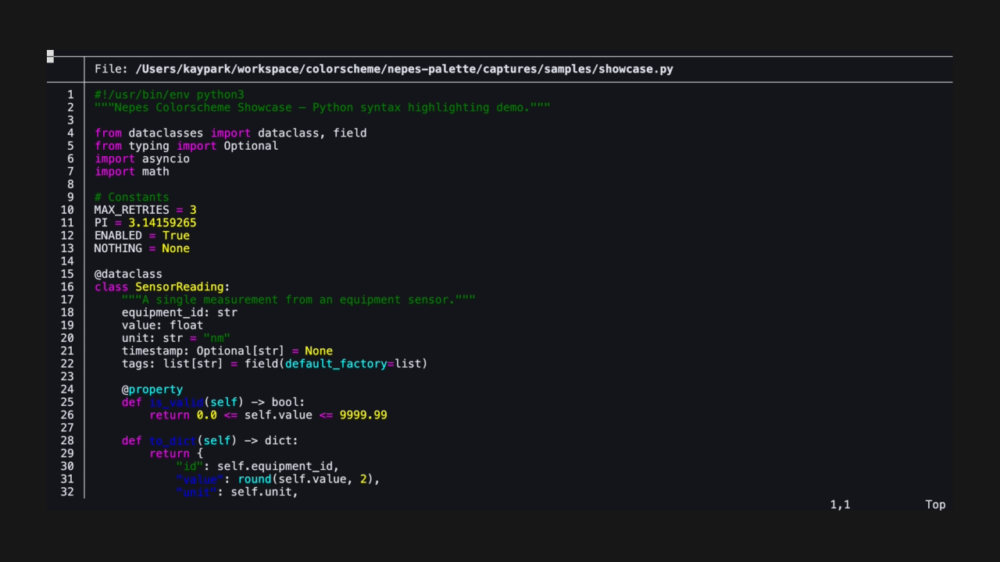
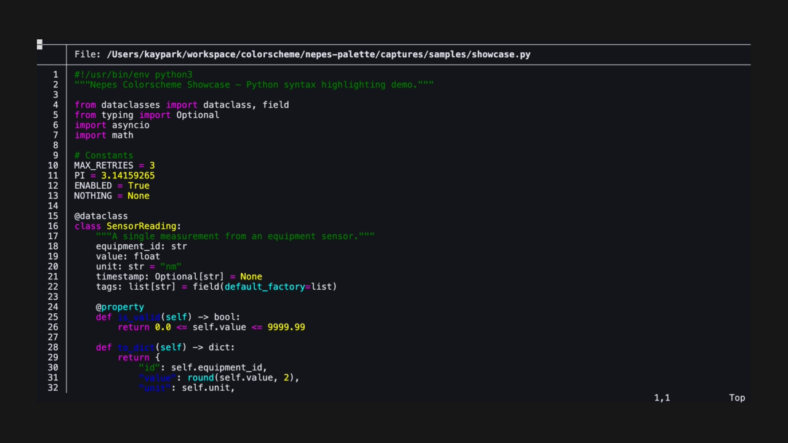

#+title: kitty-nepes
#+description: Nepes color theme for kitty

GPU-accelerated terminal emulator color theme.

Part of the [[https://github.com/kayspark][Nepes Colorscheme]] suite.

* Screenshots

| Dark | Light |
|------+-------|
|  |  |

* Installation

1. Clone this repo
2. Include in =~/.config/kitty/kitty.conf=:
#+begin_src conf
include /path/to/kitty-nepes/nepes-dark.conf
#+end_src

* Credits

Generated by [[https://github.com/kayspark/nepes-palette][nepes-palette]].
